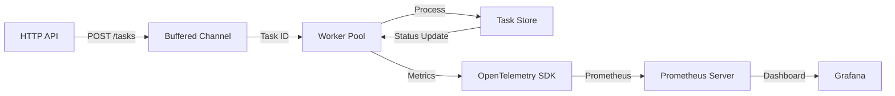

# Concurrent Job Queue

A production-grade asynchronous task processor in Go. Designed for high reliability, backpressure management, and observability using the OpenTelemetry (OTEL) ecosystem.

### 1. Problem
Modern systems require a way to offload long-running or resource-intensive tasks from the critical request path. This project solves that by decoupling task submission from execution, preventing HTTP handler exhaustion and ensuring task persistence during transient failures.

### 2. Architecture



The system uses a **producer-consumer** model with goroutines and channels to manage concurrent workloads.

### 3. Core Components
- **HTTP API:** Low-latency entry point for task submission and status tracking.
- **Worker Pool:** Fixed-size pool of goroutines to control resource consumption (CPU/Memory).
- **Observability (OTEL):** Native instrumentation with OpenTelemetry Go SDK for counters and metrics.
- **Graceful Shutdown:** `context.Context` propagation ensures in-flight jobs complete before exit.
- **Task Store:** Thread-safe state management for task lifecycle (Pending → Running → Completed).

### 4. Key Design Decisions
- **Worker Pool Pattern:** Prevents "goroutine explosion" by limiting concurrency, protecting the host system from resource exhaustion under load.
- **Task IDs over Pointers:** We pass task IDs through channels. This ensures workers always operate on the most recent state in the `TaskStore` and eliminates memory sharing/stale data risks.
- **Context-Awareness:** Every component respects `context.Context` to allow for clean timeouts and graceful service restarts.

### 5. Configuration (Environment Variables)
Tune the engine performance via standard environment variables:

| Variable | Default | Description |
|----------|---------|-------------|
| `WORKER_COUNT` | `3` | Number of concurrent worker goroutines |
| `QUEUE_SIZE` | `10` | Size of the internal task job channel (backpressure) |

### 6. Observability
- **Metrics Endpoint:** `GET /metrics` exports Prometheus-formatted data via OTEL.
- **Local Monitoring:** Includes a pre-configured Prometheus and Grafana stack.
- **Structured Logging:** JSON logs using `log/slog` for modern traceability.

### 7. How to Run

#### Local Binary
```bash
make build && make run
```

#### Docker Compose (Full Stack)
Spin up the application, Prometheus, and Grafana in one command:
```bash
docker-compose up --build
```
- **App:** `http://localhost:8080`
- **Prometheus:** `http://localhost:9090`
- **Grafana:** `http://localhost:3000` (Default: admin/admin)

#### Run Tests
```bash
make test
```
