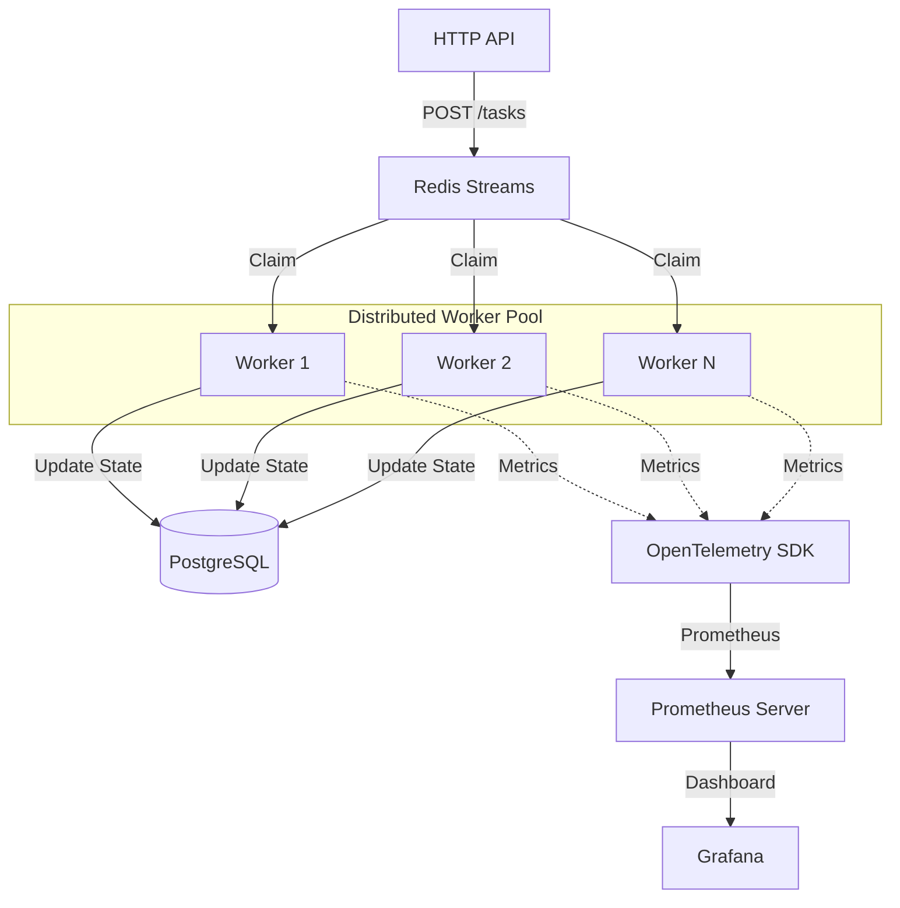

# Concurrent Job Queue

A production-grade asynchronous task processor in Go. Designed for high reliability, backpressure management, and observability using the OpenTelemetry (OTEL) ecosystem.

 [](https://sonarcloud.io/summary/new_code?id=crypticseeds_concurrent-job-queue) [](https://sonarcloud.io/summary/new_code?id=crypticseeds_concurrent-job-queue)

### 1. Problem
Modern systems require a way to offload long-running or resource-intensive tasks from the critical request path. This project solves that by decoupling task submission from execution, preventing HTTP handler exhaustion and ensuring task persistence during transient failures.

### 2. Architecture



The system is a **distributed producer-consumer** model. Multiple API instances can submit tasks to Redis Streams, and multiple stateless worker pods can consume from the same stream using **Consumer Groups** to ensure load balancing and reliability.

### 3. Core Components
- **HTTP API:** Entry point for task submission. It persists the initial task state to PostgreSQL and enqueues the task to Redis Streams.
- **Redis Streams:** Acts as the reliable, persistent message broker. It supports Consumer Groups, which allow scaling workers across multiple pods while ensuring each task is processed only once.
- **PostgreSQL:** The source of truth for task history. It stores task payloads, current status, retry counts, and error logs.
- **Stateless Workers:** Independent processing units that claim tasks from Redis, execute them, and update the state in PostgreSQL. They are designed to be easily scalable in a Kubernetes environment.
- **Observability (OTEL):** Instrumented with OpenTelemetry for tracking queue depth, task processing latency, and success/failure rates.

### 4. Task Lifecycle & Retries
1.  **Submission:** A task is created with `PENDING` status in Postgres and added to Redis.
2.  **Dequeuing:** A worker claims the task from the Redis Stream consumer group.
3.  **Execution:** The worker updates the status to `RUNNING` in Postgres and processes the task.
4.  **Completion:** On success, the task is marked `COMPLETED` in Postgres and `Acked` in Redis.
5.  **Failure:** If a task fails, it is marked `FAILED` in Postgres. The system tracks `Retries` and can reschedule tasks for later processing. Redis Pending Entry List (PEL) ensures tasks that crash during processing can be reclaimed by other workers.

### 5. Configuration (Environment Variables)

| Variable | Default | Description |
|----------|---------|-------------|
| `WORKER_COUNT` | `10`    | Number of concurrent worker goroutines per pod |
| `REDIS_ADDR` | `""`   | Address of the Redis server (e.g. `redis:6379`). If empty, uses in-memory queue. |
| `DATABASE_URL` | `""`   | PostgreSQL connection string. If empty, uses in-memory store. |
| `TASK_TTL` | `1h` | Time-to-live for terminal tasks (Completed/Failed) before cleanup. |

### 6. Observability
- **Metrics Endpoint:** `GET /metrics` exports:
    - `queue_depth`: Current number of pending tasks in Redis.
    - `task_processing_duration_seconds`: Histogram of time taken to process tasks.
    - `tasks_completed_total` / `tasks_failed_total`: Throughput counters.
- **Local Monitoring:** Pre-configured Prometheus and Grafana stack included in `docker-compose.yml`.
- **Structured Logging:** JSON logs using `log/slog` for distributed tracing.

### 7. How to Run

#### Docker Compose (Recommended)
This is the easiest way to run the full distributed stack (App, Redis, Postgres, Prometheus, Grafana):
```bash
docker-compose up --build
```
- **App:** `http://localhost:8080`
- **Prometheus:** `http://localhost:9090`
- **Grafana:** `http://localhost:3000` (Default: admin/admin)

#### Kubernetes (KIND Cluster)
The project includes manifests for running in a 2-3 node KIND cluster:
1. Ensure you have a KIND cluster running.
2. Apply manifests:
```bash
kubectl apply -k k8s/base
```

#### Local Development
For a quick start without Redis/Postgres (falling back to in-memory):
```bash
make build && make run
```

---

## Future Improvements
 - **KEDA Scaling:** Implement Kubernetes Event-driven Autoscaling (KEDA) to scale worker pods based on Redis stream depth.
 - **HA Redis/Postgres:** Deploy Redis Sentinel and PostgreSQL replication for high availability.
 - **RabbitMQ Support:** Add an implementation of the `Queue` interface for RabbitMQ to support more complex routing patterns.
 - **Dead Letter Queue (DLQ):** Automatically move tasks that exceed maximum retries to a separate DLQ for manual inspection.
## Load Testing

### 8. Stress Testing with k6 (`load-tests/stress_test.js`)

This project includes a **k6** stress test to evaluate system stability and performance under heavy load.

*   **Load Profile:**
    *   **Ramp-up:** Gradually increases to 50 virtual users (VUs) over 1 minute.
    *   **Peak Load:** Sustains 100 VUs for 3 minutes to simulate high traffic.
    *   **Ramp-down:** Controlled reduction to 0 VUs over 1 minute and 30 seconds.
*   **Performance Thresholds:**
    *   **Error Rate:** Must stay below 1% (`http_req_failed < 0.01`).
    *   **Latency (p95):** 95% of requests must complete under 500ms (`p(95) < 500`).
*   **SRE Value:**
    *   **Capacity Planning:** Identifies the saturation point of the worker pool and internal queue.
    *   **Reliability Verification:** Ensures the system gracefully handles backpressure without crashing.
    *   **SLO Alignment:** Validates that latency and error rate targets are met under realistic stress.

### 9. API Testing with Bruno (`bruno/`)

The `bruno/` directory provides a ready-to-run API test collection for this service using **Bruno**, an offline-first alternative to Postman.

* **Purpose:** Version-controlled API requests covering smoke, concurrency, and negative test cases.
* **Usage:** Validate key endpoints (e.g. health, metrics, create/get task) locally without cloud dependencies.
* **Benefit:** Fast, reproducible testing with no external sync or account required.

## Future Improvements
 - **KEDA Scaling:** Implement Kubernetes Event-driven Autoscaling (KEDA) to scale worker pods based on Redis stream depth.
 - **HA Redis/Postgres:** Deploy Redis Sentinel and PostgreSQL replication for high availability.
 - **RabbitMQ Support:** Add an implementation of the `Queue` interface for RabbitMQ to support more complex routing patterns.
 - **Dead Letter Queue (DLQ):** Automatically move tasks that exceed maximum retries to a separate DLQ for manual inspection.
 - **Auth/AuthZ:** Add API key or JWT authentication to secure task submission and status endpoints.
 - **Priority Queuing:** Enable a priority system to ensure critical tasks bypass the standard queue when under heavy load.

---

<div align="center">

### 🔗 Connect with Me

[](https://devopsfoundry.com/projects/)
[](https://www.linkedin.com/in/femi-akinlotan/)
[](mailto:femi.akinlotan@devopsfoundry.com)

**Built with ❤️ by Femi Akinlotan**

</div>