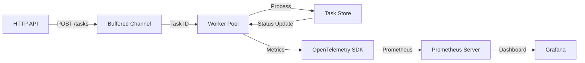

# Concurrent Job Queue

A production-grade asynchronous task processor in Go. Designed for high reliability, backpressure management, and observability using the OpenTelemetry (OTEL) ecosystem.

 

### 1. Problem
Modern systems require a way to offload long-running or resource-intensive tasks from the critical request path. This project solves that by decoupling task submission from execution, preventing HTTP handler exhaustion and ensuring task persistence during transient failures.

### 2. Architecture



The system uses a **producer-consumer** model with goroutines and channels to manage concurrent workloads.

### 3. Core Components
- **HTTP API:** Low-latency entry point for task submission and status tracking.
- **Worker Pool:** Fixed-size pool of goroutines to control resource consumption (CPU/Memory).
- **Observability (OTEL):** Native instrumentation with OpenTelemetry Go SDK for counters and metrics.
- **Graceful Shutdown:** `context.Context` propagation ensures in-flight jobs complete before exit.
- **Task Store:** Thread-safe state management for task lifecycle (Pending → Running → Completed).

### 4. Key Design Decisions
- **Worker Pool Pattern:** Prevents "goroutine explosion" by limiting concurrency, protecting the host system from resource exhaustion under load.
- **Task IDs over Pointers:** We pass task IDs through channels. This ensures workers always operate on the most recent state in the `TaskStore` and eliminates memory sharing/stale data risks.
- **Context-Awareness:** Every component respects `context.Context` to allow for clean timeouts and graceful service restarts.

### 5. Configuration (Environment Variables)
Tune the engine performance via standard environment variables:

| Variable | Default | Description |
|----------|---------|-------------|
| `WORKER_COUNT` | `50`    | Number of concurrent worker goroutines |
| `QUEUE_SIZE` | `500`   | Size of the internal task job channel (backpressure) |

### 6. Observability
- **Metrics Endpoint:** `GET /metrics` exports Prometheus-formatted data via OTEL.
- **Local Monitoring:** Includes a pre-configured Prometheus and Grafana stack.
- **Structured Logging:** JSON logs using `log/slog` for modern traceability.

### 7. How to Run

#### Local Binary
```bash
make build && make run
```

#### Docker Compose (Full Stack)
Spin up the application, Prometheus, and Grafana in one command:
```bash
docker-compose up --build
```
- **App:** `http://localhost:8080`
- **Prometheus:** `http://localhost:9090`
- **Grafana:** `http://localhost:3000` (Default: admin/admin)

#### Run Tests
```bash
make test
```
## Load Testing

### 8. Stress Testing with k6 (`load-tests/stress_test.js`)

This project includes a **k6** stress test to evaluate system stability and performance under heavy load.

*   **Load Profile:**
    *   **Ramp-up:** Gradually increases to 50 virtual users (VUs) over 1 minute.
    *   **Peak Load:** Sustains 100 VUs for 3 minutes to simulate high traffic.
    *   **Ramp-down:** Controlled reduction to 0 VUs over 1 minute and 30 seconds.
*   **Performance Thresholds:**
    *   **Error Rate:** Must stay below 1% (`http_req_failed < 0.01`).
    *   **Latency (p95):** 95% of requests must complete under 500ms (`p(95) < 500`).
*   **SRE Value:**
    *   **Capacity Planning:** Identifies the saturation point of the worker pool and internal queue.
    *   **Reliability Verification:** Ensures the system gracefully handles backpressure without crashing.
    *   **SLO Alignment:** Validates that latency and error rate targets are met under realistic stress.

### 9. API Testing with Bruno (`bruno/`)

The `bruno/` directory provides a ready-to-run API test collection for this service using **Bruno**, an offline-first alternative to Postman.

* **Purpose:** Version-controlled API requests covering smoke, concurrency, and negative test cases.
* **Usage:** Validate key endpoints (e.g. health, metrics, create/get task) locally without cloud dependencies.
* **Benefit:** Fast, reproducible testing with no external sync or account required.

## Future Improvements
 - **Distributed Task Queue:** Transition to **RabbitMQ** or **Redis** for persistent, multi-node task distribution, improving horizontal scalability.
 - **Resilience Patterns:** Implement **Circuit Breaker** (e.g., using [`sony/gobreaker`](https://github.com/sony/gobreaker.git)) and **Retries** with exponential backoff for external API calls/worker failures.
 - **Persistent Storage:** Replace the in-memory `TaskStore` with **PostgreSQL** to maintain state across service restarts.
 - **Auth/AuthZ:** Add API key or JWT authentication to secure task submission and status endpoints.
 - **Priority Queuing:** Enable a priority system to ensure critical tasks bypass the standard queue when under heavy load.

---

<div align="center">

### 🔗 Connect with Me

[](https://devopsfoundry.com/projects/)
[](https://www.linkedin.com/in/femi-akinlotan/)
[](mailto:femi.akinlotan@devopsfoundry.com)

**Built with ❤️ by Femi Akinlotan**

</div>