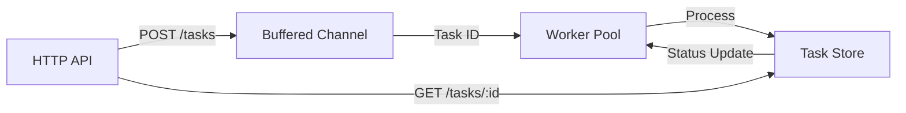

# Concurrent Job Queue

A production-grade asynchronous task processor in Go. Designed for high reliability, backpressure management, and graceful system degradation.

### 1. Problem
Modern systems require a way to offload long-running or resource-intensive tasks from the critical request path. This project solves that by decoupling task submission from execution, preventing HTTP handler exhaustion and ensuring task persistence during transient failures.

### 2. Architecture



The system uses a **producer-consumer** model with goroutines and channels to manage concurrent workloads.

### 3. Core Components
- **HTTP API:** Low-latency entry point for task submission and status tracking.
- **In-memory Queue:** Buffered channel providing backpressure and decoupling.
- **Worker Pool:** A fixed number of goroutines to control resource consumption (CPU/Memory).
- **Graceful Shutdown:** `context.Context` propagation ensures in-flight jobs complete before exit.
- **Task Store:** Thread-safe state management for task lifecycle (Pending → Running → Completed).

### 4. Key Design Decisions
- **Worker Pool Pattern:** Prevents "goroutine explosion" by limiting concurrency, protecting the host system from resource exhaustion under load.
- **Task IDs over Pointers:** We pass task IDs through channels. This ensures workers always operate on the most recent state in the `TaskStore` and eliminates memory sharing/stale data risks.
- **Context-Awareness:** Every component respects `context.Context` to allow for clean timeouts and graceful service restarts.

### 5. Optional Upgrade (Redis Backend)
For production environments, the in-memory `TaskStore` can be swapped for **Redis**:
- **Persistence:** Survives service restarts/crashes.
- **Horizontal Scaling:** Multiple service instances can share the same Redis task queue.

### 6. How to Run

```bash
# Build the binary
make build

# Run the server
make run

# Run tests
make test
```